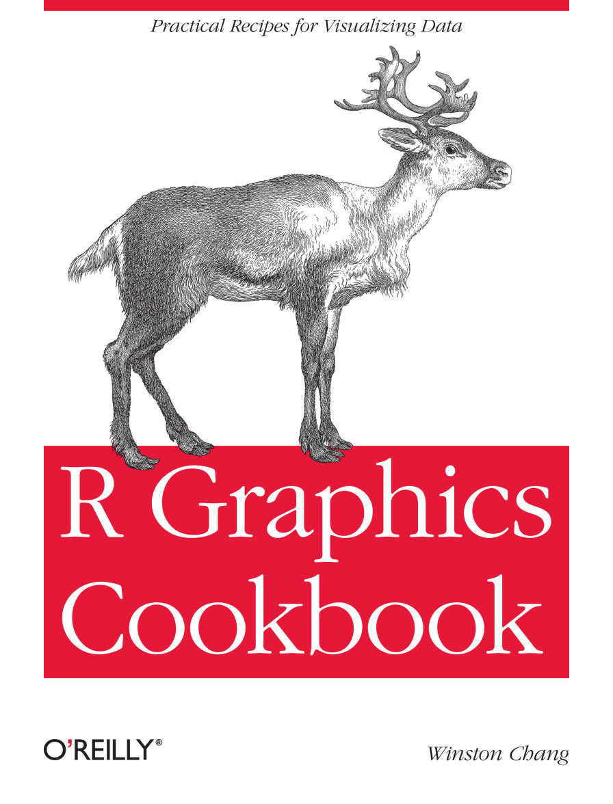

# R Graphics Cookbook(Chang)

## Info
[O'reilly](http://shop.oreilly.com/product/0636920023135.do)

## Toc
* **[Chapter 1. R Basics](Ch01_R_Basics.Rmd)**  
  * 1.1. Installing a Package  
  * 1.2. Loading a Package  
  * 1.3. Loading a Delimited Text Data File  
  * 1.4. Loading Data from an Excel File  
  * 1.5. Loading Data from an SPSS File  
* **Chapter 2. Quickly Exploring Data**  
  * 2.1. Creating a Scatter Plot  
  * 2.2. Creating a Line Graph  
  * 2.3. Creating a Bar Graph  
  * 2.4. Creating a Histogram  
  * 2.5. Creating a Box Plot  
  * 2.6. Plotting a Function Curve  
* **Chapter 3. Bar Graphs**  
  * 3.1. Making a Basic Bar Graph  
  * 3.2. Grouping Bars Together  
  * 3.3. Making a Bar Graph of Counts  
  * 3.4. Using Colors in a Bar Graph  
  * 3.5. Coloring Negative and Positive Bars Differently  
  * 3.6. Adjusting Bar Width and Spacing  
  * 3.7. Making a Stacked Bar Graph  
  * 3.8. Making a Proportional Stacked Bar Graph  
  * 3.9. Adding Labels to a Bar Graph  
  * 3.10. Making a Cleveland Dot Plot  
* **Chapter 4. Line Graphs**  
  * 4.1. Making a Basic Line Graph  
  * 4.2. Adding Points to a Line Graph  
  * 4.3. Making a Line Graph with Multiple Lines  
  * 4.4. Changing the Appearance of Lines  
  * 4.5. Changing the Appearance of Points  
  * 4.6. Making a Graph with a Shaded Area  
  * 4.7. Making a Stacked Area Graph  
  * 4.8. Making a Proportional Stacked Area Graph  
  * 4.9. Adding a Confidence Region  
* **Chapter 5. Scatter Plots**  
  * 5.1. Making a Basic Scatter Plot  
  * 5.2. Grouping Data Points by a Variable Using Shape or Color  
  * 5.3. Using Different Point Shapes  
  * 5.4. Mapping a Continuous Variable to Color or Size  
  * 5.5. Dealing with Overplotting  
  * 5.6. Adding Fitted Regression Model Lines  
  * 5.7. Adding Fitted Lines from an Existing Model  
  * 5.8. Adding Fitted Lines from Multiple Existing Models  
  * 5.9. Adding Annotations with Model Coefficients  
  * 5.10. Adding Marginal Rugs to a Scatter Plot  
  * 5.11. Labeling Points in a Scatter Plot  
  * 5.12. Creating a Balloon Plot  
  * 5.13. Making a Scatter Plot Matrix  
* **Chapter 6. Summarized Data Distributions**  
  * 6.1. Making a Basic Histogram  
  * 6.2. Making Multiple Histograms from Grouped Data  
  * 6.3. Making a Density Curve  
  * 6.4. Making Multiple Density Curves from Grouped Data  
  * 6.5. Making a Frequency Polygon  
  * 6.6. Making a Basic Box Plot  
  * 6.7. Adding Notches to a Box Plot  
  * 6.8. Adding Means to a Box Plot  
  * 6.9. Making a Violin Plot  
  * 6.10. Making a Dot Plot  
  * 6.11. Making Multiple Dot Plots for Grouped Data  
  * 6.12. Making a Density Plot of Two-Dimensional Data  
* **Chapter 7. Annotations**  
  * 7.1. Adding Text Annotations  
  * 7.2. Using Mathematical Expressions in Annotations  
  * 7.3. Adding Lines  
  * 7.4. Adding Line Segments and Arrows  
  * 7.5. Adding a Shaded Rectangle  
  * 7.6. Highlighting an Item  
  * 7.7. Adding Error Bars  
  * 7.8. Adding Annotations to Individual Facets  
* **Chapter 8. Axes**  
  * 8.1. Swapping X- and Y-Axes  
  * 8.2. Setting the Range of a Continuous Axis  
  * 8.3. Reversing a Continuous Axis  
  * 8.4. Changing the Order of Items on a Categorical Axis  
  * 8.5. Setting the Scaling Ratio of the X- and Y-Axes  
  * 8.6. Setting the Positions of Tick Marks  
  * 8.7. Removing Tick Marks and Labels  
  * 8.8. Changing the Text of Tick Labels  
  * 8.9. Changing the Appearance of Tick Labels  
  * 8.10. Changing the Text of Axis Labels  
  * 8.11. Removing Axis Labels  
  * 8.12. Changing the Appearance of Axis Labels  
  * 8.13. Showing Lines Along the Axes  
  * 8.14. Using a Logarithmic Axis  
  * 8.15. Adding Ticks for a Logarithmic Axis  
  * 8.16. Making a Circular Graph  
  * 8.17. Using Dates on an Axis  
  * 8.18. Using Relative Times on an Axis  
* **Chapter 9. Controlling the Overall Appearance of Graphs**  
  * 9.1. Setting the Title of a Graph  
  * 9.2. Changing the Appearance of Text  
  * 9.3. Using Themes  
  * 9.4. Changing the Appearance of Theme Elements  
  * 9.5. Creating Your Own Themes  
  * 9.6. Hiding Grid Lines  
* **Chapter 10. Legends**  
  * 10.1. Removing the Legend  
  * 10.2. Changing the Position of a Legend  
  * 10.3. Changing the Order of Items in a Legend  
  * 10.4. Reversing the Order of Items in a Legend  
  * 10.5. Changing a Legend Title  
  * 10.6. Changing the Appearance of a Legend Title  
  * 10.7. Removing a Legend Title  
  * 10.8. Changing the Labels in a Legend  
  * 10.9. Changing the Appearance of Legend Labels  
  * 10.10. Using Labels with Multiple Lines of Text  
* **Chapter 11. Facets**  
  * 11.1. Splitting Data into Subplots with Facets  
  * 11.2. Using Facets with Different Axes  
  * 11.3. Changing the Text of Facet Labels  
  * 11.4. Changing the Appearance of Facet Labels and Headers  
* **Chapter 12. Using Colors in Plots**  
  * 12.1. Setting the Colors of Objects  
  * 12.2. Mapping Variables to Colors  
  * 12.3. Using a Different Palette for a Discrete Variable  
  * 12.4. Using a Manually Defined Palette for a Discrete Variable  
  * 12.5. Using a Colorblind-Friendly Palette  
  * 12.6. Using a Manually Defined Palette for a Continuous Variable  
  * 12.7. Coloring a Shaded Region Based on Value  
* **Chapter 13. Miscellaneous Graphs**  
  * 13.1. Making a Correlation Matrix  
  * 13.2. Plotting a Function  
  * 13.3. Shading a Subregion Under a Function Curve  
  * 13.4. Creating a Network Graph  
  * 13.5. Using Text Labels in a Network Graph  
  * 13.6. Creating a Heat Map  
  * 13.7. Creating a Three-Dimensional Scatter Plot  
  * 13.8. Adding a Prediction Surface to a Three-Dimensional Plot  
  * 13.9. Saving a Three-Dimensional Plot  
  * 13.10. Animating a Three-Dimensional Plot  
  * 13.11. Creating a Dendrogram  
  * 13.12. Creating a Vector Field  
  * 13.13. Creating a QQ Plot  
  * 13.14. Creating a Graph of an Empirical Cumulative  
  * 13.15. Creating a Mosaic Plot  
  * 13.16. Creating a Pie Chart  
  * 13.17. Creating a Map  
  * 13.18. Creating a Choropleth Map  
  * 13.19. Making a Map with a Clean Background  
  * 13.20. Creating a Map from a Shapefile  
* **Chapter 14. Output for Presentation**  
  * 14.1. Outputting to PDF Vector Files  
  * 14.2. Outputting to SVG Vector Files  
  * 14.3. Outputting to WMF Vector Files  
  * 14.4. Editing a Vector Output File  
  * 14.5. Outputting to Bitmap (PNG/TIFF) Files  
  * 14.6. Using Fonts in PDF Files  
  * 14.7. Using Fonts in Windows Bitmap or Screen Output  
* **Chapter 15. Getting Your Data into Shape**  
  * 15.1. Creating a Data Frame  
  * 15.2. Getting Information About a Data Structure  
  * 15.3. Adding a Column to a Data Frame  
  * 15.4. Deleting a Column from a Data Frame  
  * 15.5. Renaming Columns in a Data Frame  
  * 15.6. Reordering Columns in a Data Frame  
  * 15.7. Getting a Subset of a Data Frame  
  * 15.8. Changing the Order of Factor Levels  
  * 15.9. Changing the Order of Factor Levels Based on Data Values  
  * 15.10. Changing the Names of Factor Levels  
  * 15.11. Removing Unused Levels from a Factor  
  * 15.12. Changing the Names of Items in a Character Vector  
  * 15.13. Recoding a Categorical Variable to Another Categorical Variable  
  * 15.14. Recoding a Continuous Variable to a Categorical Variable  
  * 15.15. Transforming Variables  
  * 15.16. Transforming Variables by Group  
  * 15.17. Summarizing Data by Groups  
  * 15.18. Summarizing Data with Standard Errors and  
  * 15.19. Converting Data from Wide to Long  
  * 15.20. Converting Data from Long to Wide  
  * 15.21. Converting a Time Series Object to Times and Values  
  * Background  
